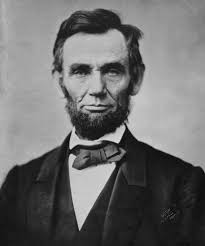

## Historic image: Check-point Charlie (end of World-War II) - SR x2
# Real image

    

        

            
        

        

            
            <button onclick="zssrgan(Lincoln-switch)">Click me</button>
        

    

